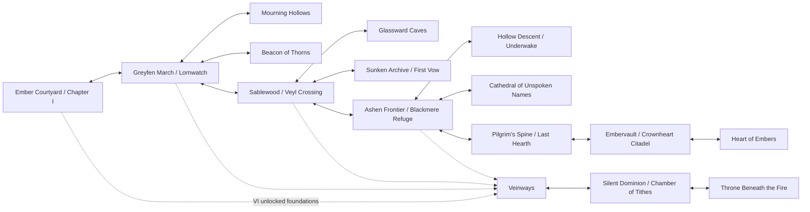

# Interconnected world and extensible RPG architecture

## Geography and Wayflames

Implemented Chapter I roads form a connected region. Home and supply house connect to Ember Courtyard; east leads through Ruined Approach into Ashen Wood; north leads to Forsaken Shrine; a puzzle-sealed northern passage reaches the inner sanctuary. Return routes stay accessible. Cleared enemies do not reappear. Courtyard, wood, and sanctuary Wayflames enable travel once awakened; the sanctuary marker answers only after local restoration.

Future region graph:

Chapter II now connects Ashen Wood east to Lornwatch, then Greyfen March. Greyfen north reaches the Beacon of Thorns; south reaches the Mourning Hollows. Lornwatch, Greyfen and the restored beacon have Wayflames. These connections are playable; the remaining graph is planned. Later routes may add physical passages and relic/companion gates within earlier maps. Each settlement needs culture, architecture, recurring NPCs, equipment, rest, optional quests, history, secrets, regional relationships, and event reactions. Wayflames supplement roads and caves. Availability is an explicit condition, distinct from discovery. Their public sacred interpretation changes only with Chapter VI discoveries.

## Combat ecology and progression

| Stage | Enemy ecology / distinct mechanic | Boss mechanics to design | Progression and lore rewards |
| --- | --- | --- | --- |
| I (implemented) | Ashen beasts; Covenant sentinel; telegraphed heavy strikes | Rootbound Warden: stone carapace reduces basic blows, faster heavy rhythm below half health, Rootquake reaches all active allies | Shared XP, repaired starter weapon, mended cloak, Veilglass Mirror, Emberglass pendant; local source-attributed observations |
| II (implemented) | Fen Stalker and Covenant Mirekeeper, authored patrols and telegraphed attacks; existing enemy silhouettes retained | Thornbound Sentinel: renewing thorn shell, two different abilities in a party round break it, enraged multi-target Thornstorm | Thorn King’s Signet: +2 defense and +1 focus recovery; three rescue outcomes, dated records, optional delivery and camp trust |
| III (planned) | Crystal guardians, elemental resistance, magical disruption | Votive Colossus: protected archives and shifting defenses | Runic/exploration upgrades and sourced contradictions; puzzle tools always have class-route fallback |
| IV (planned) | Fanatics, curses, reinforcements, dangerous Veilspawn | Weeping Host: uncontrolled summons, multi-target pressure | Covenant seal with explicit curse tradeoff; faction-source lore, not objective revelation |
| V (planned) | Ashborn, sacred seals, mixed party challenges | Hollow Sovereign: multiple phases requiring accumulated roles | Milestone abilities and pilgrimage relics; Keeper's Fragment meaning withheld |
| VI (planned) | Synod enforcers, awakened constructs, status combinations | Eternal Warden: protect continuity while extraction is interrupted | Evidence-bearing access items and controlled final dilemma; no casual abrupt destruction |

Weapons, armor, and charms are typed records in `src/inventory.js`. Equipped items have unique owners, class restrictions where appropriate, and engine-consumed attack, defense, or focus effects. A worn travel coat is a starting item; the mended cloak reduces each incoming strike by two after mitigation. Repaired class weapons add three basic attack damage. Mirror and pendant each add one focus after enemy phases, and the mirror also unlocks Read Sigil. Future relics require explicit effects and tests before their menu descriptions advertise them.

Levels derive from shared milestone-sized XP thresholds; reserves gain levels alongside the protagonist. Avoid requiring random repeated grinding. Future skill unlocks, upgrades, personal quests, crafting, accessories, and elemental interactions are data-driven extensions, not decorative entries in the current UI.

## Functional management interface

Press P or Escape outside dialogue to open the management menu. Header Menu and touch buttons provide equivalent entry.

| Tab | Current behavior | Future extension contract |
| --- | --- | --- |
| Party | Active/reserve roster, four-slot cap, fixed protagonist, independent health/focus | Safe-location formation restrictions can become explicit policy; counterpart status resolved from class |
| Character | Select recruited member, view identity, level, health, focus, attack, armor, recovery | Milestone abilities and independent progression metadata |
| Equipment | Equip/remove owned weapon, armor, charm; no combat changes; unique ownership | More slot types and class-specific modifiers validated centrally |
| Relics | Owned charms, functional effects, sourced lore, link to equipment | Discovery-specific effects and character ownership, with reveal gates |
| Inventory | Supplies and gear, actual gold and potion counts | Materials and quest items only when usable systems exist |
| Abilities | Actual class skill, cost, exploration ability and discovered Read Sigil | Explicit unlock prerequisites and learned upgrades |
| Journal | Road checklist and persistent chapter objectives/discoveries | Main, side, personal quest registries and append-only decision records |
| Lore Codex | Only discovered public entries, each with source | Append observations by chapter/reliability; never replace earlier beliefs |
| Map | Connected region description, explored places, activated travel actions | Geographic graph with availability separate from discovery |
| System | Autosave, save/load, JSON export/import validation, audio toggle, controls, restart | Version migrations, settings persistence, accessibility preferences |

Controller support has not been added. Keyboard and pointer/touch controls are implemented; future controller work should map to the same command actions and preserve menu focus. Reduced motion follows the operating system/browser preference.

## Persistence and ownership

Current envelope remains version 2 to preserve the published party adventure format. `world.chapter` is optional and validated; `game.chapterEdition` identifies new Chapter I journeys. Old version 2 adventures retain their established recruitment pacing and roster. Existing version 1 local exploration saves migrate through the tested adapter without changing their inventory, dialogue, or position. New Chapter I equipment and optional chapter records are recognized by the same validator.

| State owner | Responsibilities |
| --- | --- |
| Game | Fixed protagonist class/name, roster, active IDs, shared XP, levels, health/focus, gold/potions, unique bag/equipment ownership, encounter state, acted commands, log |
| World | Region/position/facing, visited places, cleared encounter IDs, road flags, conversation/page/explicit choices, battle return location, grace distance |
| Chapter | Chapter ID/phase, resolve, optional local discoveries, mechanisms, seal, ritual, restored local light, completion acknowledgement, Wayflames, discovered lore IDs |
| Developer documents | Objective hidden history, future chapter dependencies, unimplemented region content and reveal limits |

Autosave runs after consequential interactions, dialogue page changes, battle commands, and movement. Import/load uses production validation; invalid saves do not replace a valid session. Gold, gear, enemy clearing, and puzzle rewards are one-time state transitions. Save files are downloadable separately from the game.

Future schema versions should add structured `quests`, `decisions`, `relationships`, `npcStates`, `relicUpgrades`, and append-only `discoveries` records, with migrations retaining existing states. The current chapter fields must map deterministically into those structures. Never silently infer recruited status from dialogue or remove already-earned items. Event conditions drive NPC reactions and geography. No defeated boss may respawn without a new, explicit narrative event.

## Release and spoiler boundary

`npm run build` copies only index, source, and public assets into dist and embeds player assets into standalone `play.html`. Narrative documents are developer references, excluded from the player bundle. Tests reject hidden Engine/keeper truth in the early runtime and bundle. Chapter II is playable. Chapters III–VI remain documentation; the eastern Sablewood sign explains its closed route. No menu offers travel into unfinished content. The Chapter II environment atlas uses four quadrants of one image to keep the standalone download under the 100 MiB limit.

### Chapter II persistence additions

`world.chapterTwo` is optional, requiring completed Chapter I. It records request, crossing, ledger, cup, selected rite, sluice, beacon, completion, blanket pickup/delivery, camp, recruited companion trust and discovered lore. Save validation rejects impossible dependencies and unknown choices. Chapter I fields and recruited parties remain intact. Thornbound battle state records class IDs that used abilities this round and whether the shell is broken; partial-round saves retain those commands. New enemy patrol distances use the existing validator. No schema/version reset is needed.

Sprite rendering measures alpha gutters and main silhouettes without changing source art. DOM battle sheets are registered once into cached canvas atlases; overworld frames share row measurements and feet registration. Atlas work yields between rows so it cannot monopolize animation/input. Audio uses one gesture-unlocked Web Audio context for the original score and distinct effects; mute stops all voices and suspends the context.
